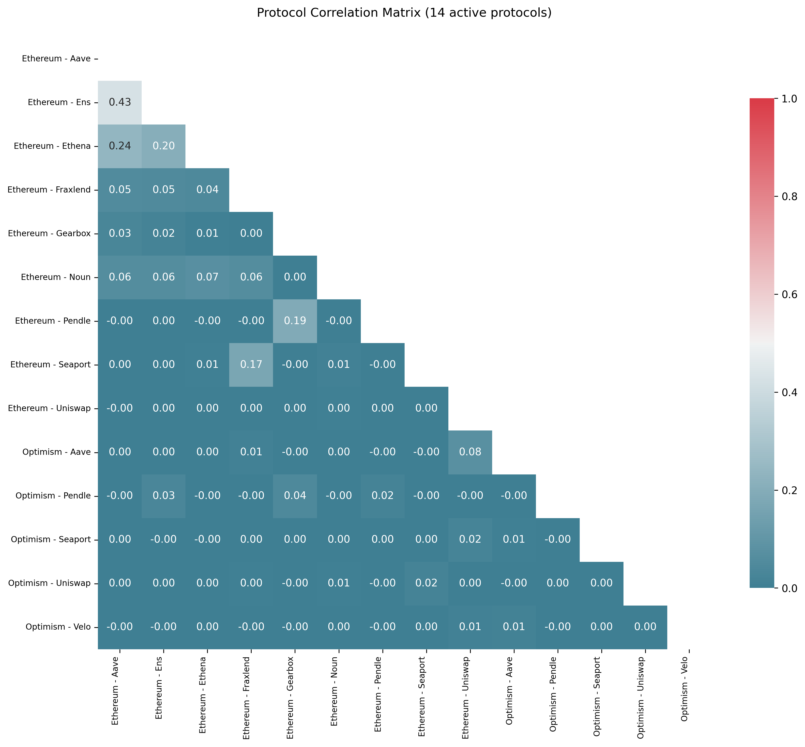

# 🔌 Plug Science

> [!NOTE]
> This repository is a submodule of the larger [Plug monorepo](https://github.com/nftchance/plug) that contains all the required pieces to run the entire Plug stack yourself.

Plug Science houses the key tools used for data science-related tasks within the Plug ecosystem. These Python-based tools are designed for local execution and provide valuable insights into user behavior across various protocols in the EVM ecosystem.

## Getting Started

Clone this repository:

```bash
git clone https://github.com/nftchance/plug-science.git
```

Create a virtual environment:

```bash
python3 -m venv venv
```

Activate the virtual environment:

```bash
source venv/bin/activate
```

Install dependencies:

```bash
pip install -r requirements.txt
```

## Correlation Analysis

Correlation analysis is a statistical method used to evaluate the strength and direction of relationships between variables. In Plug, we leverage this technique to understand user behavior across different protocols in the EVM ecosystem.

With this in your toolbox, you can run a correlation analysis on a set of protocols only by knowing the name found in the deployed onchain contracts.



1. Generate SQL query for correlation analysis

```bash
python correlation/query.py --chains ethereum base --protocols uniswap aave --protocols aero
```

2. Take the generated query and run it on Flipside.
3. Download the data from Flipside and save it to a CSV named 'actions' in the correlation directory.
4. Run the analysis and generate a correlation matrix.

```bash
python correlation/correlate.py
```

By default, no CSV is shipped with this repository because it is way too large for GitHub. To run this yourself you must retrieve the data you want to use from [Flipside](https://flipsidecrypto.xyz/).
